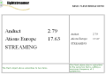
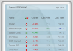

# Lightstreamer - Basic Stock-List Demo - Flash Client #

This project contains two examples of Flash application that employs the Flash/Flex JavaScript Bridge.

Any Flash application can be fed with real-time data delivered by Lightstreamer Server. The integration strategy used is based on a JavaScript/ActionScript bridge. The standard Lightstreamer JavaScript Client Library is used to implement a page that will contain the Flash application and feed it through a LightstreamerClient object. <br>
The library includes a bridge module. The lsjavascriptbridge.as library is added to the Flash movie.

The following diagram shows the data flow from Lightstreamer
Server to the Flash application:

```text
 ------          -------------------------------------------------
|  LS  |        |  LS core          JS           AS         Flash |
|      |  --->  | JavaScript -->  Bridge  -->          -->        |
|Server|        |  Client         module       Bridge        App  |
 ------          -------------------------------------------------
                                      BROWSER
```

## Basic Demo ##

<table>
  <tr>
    <td style="text-align: left">
      &nbsp;<a href="http://demos.lightstreamer.com/Flash_StockListDemo_Basic/" target="_blank"></a>&nbsp;
      
    </td>
    <td>
      &nbsp;An online demonstration is hosted on our servers at:<br>
      &nbsp;<a href="http://demos.lightstreamer.com/Flash_StockListDemo_Basic/" target="_blank">http://demos.lightstreamer.com/Flash_StockListDemo_Basic/</a>
    </td>
  </tr>
</table>

This very simple demo uses the Flash Bridge to inject real-time data into two Flash movies hosted on the page. Each of the two movies subscribes to two items of the [Stock-List Demos](https://github.com/Weswit/Lightstreamer-example-StockList-client-javascript). The smaller movie sets a maximum update frequency of 1 event/sec.

The Flash app uses the <b>ActionScript/JavaScript Bridge</b> provided as part of the "sdk_client_flash". That means the ActionScript API, used within the Flash application, talks to external JavaScript code, in the form of the [FlashBridge](http://www.lightstreamer.com/docs/client_javascript_uni_api/FlashBridge.html) class, that in turn uses a [LightstreamerClient](http://www.lightstreamer.com/docs/client_javascript_uni_api/LightstreamerClient.html) instance to handle the communications with Lightstreamer Server.

The demo includes the following client-side technologies:
* A [FlashTable](http://www.lightstreamer.com/docs/client_flash_jsdoc/FlashTable.html) containing 2 items, subscribed to in <b>MERGE</b> mode, for each Flash movie.


## StockList Demo ##

<table>
  <tr>
    <td style="text-align: left">
      &nbsp;<a href="http://demos.lightstreamer.com/Flash_StockListDemo" target="_blank"></a>&nbsp;
    </td>
    <td>
      &nbsp;An online demonstration is hosted on our servers at:<br>
      &nbsp;<a href="http://demos.lightstreamer.com/Flash_StockListDemo" target="_blank">http://demos.lightstreamer.com/Flash_StockListDemo</a>
    </td>
  </tr>
</table>

This is a Flash version of the [Lightstreamer - Basic Stock-List Demo - HTML Client](https://github.com/Weswit/Lightstreamer-example-StockList-client-javascript#basic-stock-list-demo---html-client), which displays eight stock quotes with some nice graphic effects.

The Flash app uses the <b>ActionScript/JavaScript Bridge</b> provided as part of the "sdk_client_flash". That means the ActionScript API, used within the Flash application, talks to external JavaScript code, in the form of the [FlashBridge](http://www.lightstreamer.com/docs/client_javascript_uni_api/FlashBridge.html) class, that in turn uses a [LightstreamerClient](http://www.lightstreamer.com/docs/client_javascript_uni_api/LightstreamerClient.html) instance to handle the communications with Lightstreamer Server.

The demo includes the following client-side technologies:
* A [FlashTable](http://www.lightstreamer.com/docs/client_flash_jsdoc/FlashTable.html) containing 8 items, subscribed to in <b>MERGE</b> mode.

# Build #

The src/[demo_name]/flash directories contain the sources to build the Flash movies from a Flash IDE. Please once obtained the movies (test_movie.swf, test_movie2.swf and demoFlashSmall.swf) copy them to the /js folders of their respective demo. 

# Deploy #

Before you can run the demos of this project some dependencies need to be solved:

-  Get the lightstreamer.js file from the [latest Lightstreamer distribution](http://www.lightstreamer.com/download) in the /DOCS-SDKs/sdk_client_javascript/lib folder
   and put it in the src/[demo_name]/js folder of the demo. Alternatively you can build a lightstreamer.js file from the 
   [online generator](http://www.lightstreamer.com/distros/Lightstreamer_Allegro-Presto-Vivace_5_1_1_Colosseo_20130305/Lightstreamer/DOCS-SDKs/sdk_client_javascript/tools/generator.html).
   In that case be sure to include the LightstreamerClient, Subscription, DynaGrid, StaticGrid, Chart, SimpleChartListener, and StatusWidget modules and to use the "Use AMD" version.
-  Get the require.js file form [requirejs.org](http://requirejs.org/docs/download.html) and put it in the src/[demo_name]/js folder of the demo.
-  Get the swfobject.js version 2.2 file form [SWFObject 2](http://code.google.com/p/swfobject/downloads/list) and put it in the src/[demo_name]/js folder of the demo.

You can deploy these demos in order to use the Lightstreamer server as Web server or in any external Web Server you are running. 
If you choose the former case please note that in the <LS_HOME>/pages/demos/ folder there is a copy of the src/[demo_name] directories of this project, in other cases please create the folders <LS_HOME>/pages/demos/[demo_name] then copy here the contents of the src/[demo_name] folder of this project.<br>
The client demos configuration assumes that Lightstreamer Server, Lightstreamer Adapters and this client are launched on the same machine. If you need to targeting a different Lightstreamer server please search this line:
```js
var lsClient = new LightstreamerClient(protocolToUse+"//localhost:8080","DEMO");
```
in lsClient.js or index.html, depending on the demo, and change it accordingly.<br>
Anyway the [QUOTE_ADAPTER](https://github.com/Weswit/Lightstreamer-example-Stocklist-adapter-java) and [LiteralBasedProvider](https://github.com/Weswit/Lightstreamer-example-ReusableMetadata-adapter-java) have to be deployed in your local Lightstreamer server instance. The factory configuration of Lightstreamer server already provides this adapter deployed.<br>
The demos are now ready to be launched.

# See Also #

## Lightstreamer Adapters needed by these demo clients ##

* [Lightstreamer - Stock- List Demo - Java SE Adapter](https://github.com/Weswit/Lightstreamer-example-Stocklist-adapter-java)
* [Lightstreamer - Reusable Metadata Adapters- Java SE Adapter](https://github.com/Weswit/Lightstreamer-example-ReusableMetadata-adapter-java)

## Similar demo clients that may interest you ##

* [Lightstreamer - Stock-List Demos - HTML Clients](https://github.com/Weswit/Lightstreamer-example-Stocklist-client-javascript)
* [Lightstreamer - Basic Stock-List Demo - jQuery (jqGrid) Client](https://github.com/Weswit/Lightstreamer-example-StockList-client-jquery)
* [Lightstreamer - Stock-List Demo - Dojo Toolkit Client](https://github.com/Weswit/Lightstreamer-example-StockList-client-dojo)
* [Lightstreamer - Basic Stock-List Demo - Java SE Client](https://github.com/Weswit/Lightstreamer-example-StockList-client-java)
* [Lightstreamer - Basic Stock-List Demo - .NET Client](https://github.com/Weswit/Lightstreamer-example-StockList-client-dotnet)
* [Lightstreamer - Basic Stock-List Demo - Flex Client](https://github.com/Weswit/Lightstreamer-example-StockList-client-flex)

# Lightstreamer Compatibility Notes #

- Compatible with Lightstreamer JavaScript Client library version 6.0 or newer.
