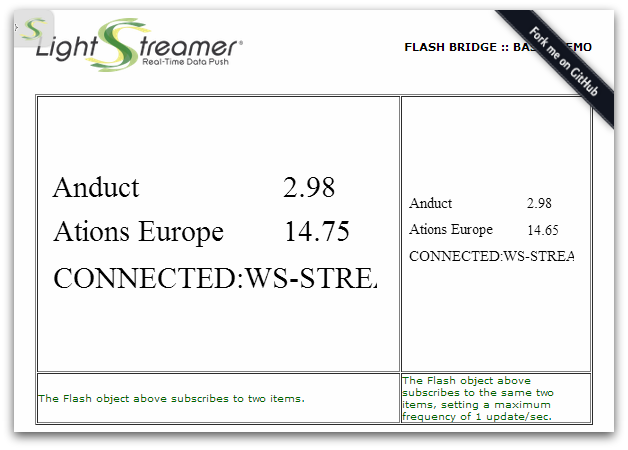
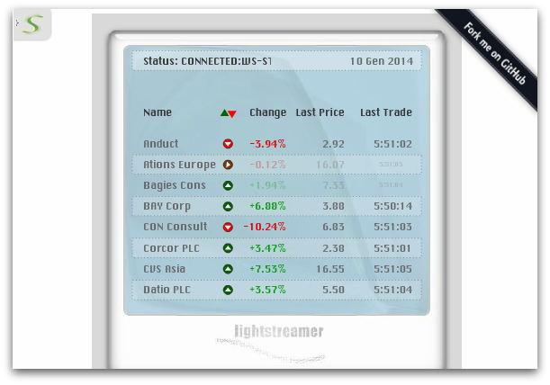

## Lightstreamer - Stock-List Demos - Flash Clients

This project contains two examples of Flash application that employs the <b>Flash/Flex JavaScript Bridge</b>.

Any Flash application can be fed with real-time data delivered by Lightstreamer Server. The integration strategy used is based on a JavaScript/ActionScript bridge. The standard <b>Lightstreamer JavaScript Client Library</b> is used to implement a page that will contain the Flash application and feed it through a LightstreamerClient object. <br>
The library includes a bridge module. The `lsjavascriptbridge.as` library is added to the Flash movie.

The following diagram shows the data flow from Lightstreamer
Server to the Flash application:

```text
 ------          -------------------------------------------------
|  LS  |        |  LS core          JS           AS         Flash |
|      |  --->  | JavaScript -->  Bridge  -->          -->        |
|Server|        |  Client         module       Bridge        App  |
 ------          -------------------------------------------------
                                      BROWSER
```

## Basic Stock-List Demo - Flash Client

### Live Demo

[](http://demos.lightstreamer.com/Flash_StockListDemo_Basic)<br>
### [ View live demo](http://demos.lightstreamer.com/Flash_StockListDemo_Basic)<br>

### Details

<!-- START DESCRIPTION lightstreamer-example-stocklist-client-flash-basic-stock-list-demo---flash-client -->

This very simple demo uses the Flash Bridge to inject real-time data into two Flash movies hosted on the page. Each of the two movies subscribes to two items of the [Stock-List Demos](https://github.com/Lightstreamer/Lightstreamer-example-StockList-client-javascript). The smaller movie sets a maximum update frequency of 1 event/sec.

The Flash app uses the <b>ActionScript/JavaScript Bridge</b> provided as part of the "sdk_client_flash". That means the ActionScript API, used within the Flash application, talks to external JavaScript code, in the form of the [FlashBridge](https://lightstreamer.com/api/ls-web-client/latest/FlashBridge.html) class, that, in turn, uses a [LightstreamerClient](https://lightstreamer.com/docs/client_javascript_uni_api/LightstreamerClient.html) instance to handle the communications with Lightstreamer Server.

The demo includes the following client-side functionalities:
* A [FlashTable](https://lightstreamer.com/api/ls-flash-client/latest/FlashTable.html) containing 2 items, subscribed to in <b>MERGE</b> mode, for each Flash movie.

<!-- END DESCRIPTION lightstreamer-example-stocklist-client-flash-basic-stock-list-demo---flash-client -->


## Stock-List Demo - Flash Client

### Live Demo

[](http://demos.lightstreamer.com/Flash_StockListDemo)<br>
### [ View live demo](http://demos.lightstreamer.com/Flash_StockListDemo)<br>

### Details

<!-- START DESCRIPTION lightstreamer-example-stocklist-client-flash-stock-list-demo---flash-client -->

This is a Flash version of the [Lightstreamer - Basic Stock-List Demo - HTML Client](https://github.com/Lightstreamer/Lightstreamer-example-StockList-client-javascript#basic-stock-list-demo---html-client), which displays eight stock quotes with some nice graphic effects.

The Flash app uses the <b>ActionScript/JavaScript Bridge</b> provided as part of the "sdk_client_flash". That means the ActionScript API, used within the Flash application, talks to external JavaScript code, in the form of the [FlashBridge](https://lightstreamer.com/api/ls-web-client/latest/FlashBridge.html) class, that, in turn, uses a [LightstreamerClient](http://www.lightstreamer.com/docs/client_javascript_uni_api/LightstreamerClient.html) instance to handle the communications with Lightstreamer Server.

The demo includes the following client-side functionalities:
* A [FlashTable](https://lightstreamer.com/api/ls-flash-client/latest/FlashTable.html) containing 8 items, subscribed to in <b>MERGE</b> mode.

<!-- END DESCRIPTION lightstreamer-example-stocklist-client-flash-stock-list-demo---flash-client -->

## Install

If you want to install a version of these demos pointing to your local Lightstreamer Server, follow these steps:

* Note that, as prerequisite, the [Lightstreamer - Stock- List Demo - Java Adapter](https://github.com/Lightstreamer/Lightstreamer-example-Stocklist-adapter-java) has to be deployed on your local Lightstreamer Server instance. Please check out that project and follow the installation instructions provided with it.
* Launch Lightstreamer Server.
* Download the `deploy.zip` file that you can find in the [deploy release](https://github.com/Lightstreamer/Lightstreamer-example-StockList-client-flash/releases) of this project and extract the `Flash_StockListDemo_Basic` and/or `Flash_StockListDemo` folder.
* Crate the folders `/pages/demos/[demo_name]` into your Lightstreamer server installation, then copy here the contents of the `Flash_StockListDemo_Basic` or `Flash_StockListDemo` folder.
* Get the `lightstreamer.js` file from [Lightstreamer distribution](http://www.lightstreamer.com/download) (see compatibility notes below) in the `/DOCS-SDKs/sdk_client_web_unified/lib` folder and put it in the `/[demo_name]/js` folder of the demo.
  The version required by this demo can be found in Lightstreamer version 5.1.2 to 7.0.
* Get the `require.js` file form [requirejs.org](http://requirejs.org/docs/download.html) and put it in the `/[demo_name]/js` folder of the demo.
* Get the `swfobject.js` version 2.2 file form [SWFObject 2](http://code.google.com/p/swfobject/downloads/list) and put it in the `/[demo_name]/js` folder of the demo.
* Launch the demo.

## Build

To build your own version of the Flash movies, instead of using the one provided in the `deploy.zip` file from the Install section above, the `src/[demo_name]/flash` directories contain the sources to build from a Flash IDE.<br>
Before you can build the demos, you need to get the latest <b>ActionScript/JavaScript Bridge</b> (`lsjavascriptbridge.as` file) from the [Lightstreamer Flash Client SDK resources](https://lightstreamer.com/res/ls-flash-client/latest/usage.html).<br>
Once the movies are obtained (`test_movie.swf`, `test_movie2.swf`, and `demoFlashSmall.swf`), copy them to the `/js` folders of their respective demo. 

You can deploy these demos to use the Lightstreamer server as Web server or in any external Web Server you are running. 
If you choose the former case, please create the folders `<LS_HOME>/pages/demos/[demo_name]` then copy here the contents of the `src/[demo_name]` folder of this project.<br>
The client demos configuration assumes that Lightstreamer Server, Lightstreamer Adapters, and this client are launched on the same machine. If you need to target a different Lightstreamer server, please search this line:
```js
var lsClient = new LightstreamerClient(protocolToUse+"//localhost:8080","DEMO");
```
in `lsClient.js` or `index.html`, depending on the demo, and change it accordingly.<br>
Anyway, the [QUOTE_ADAPTER](https://github.com/Lightstreamer/Lightstreamer-example-Stocklist-adapter-java) has to be deployed in your local Lightstreamer server instance;
the [LiteralBasedProvider](https://github.com/Lightstreamer/Lightstreamer-example-ReusableMetadata-adapter-java) is also needed, but it is already provided by Lightstreamer server.<br>
The demos are now ready to be launched.

## See Also

### Lightstreamer Adapters Needed by These Demo Clients
<!-- START RELATED_ENTRIES -->

* [Lightstreamer - Stock-List Demo - Java Adapter](https://github.com/Lightstreamer/Lightstreamer-example-Stocklist-adapter-java)
* [Lightstreamer - Reusable Metadata Adapters- Java Adapter](https://github.com/Lightstreamer/Lightstreamer-example-ReusableMetadata-adapter-java)

<!-- END RELATED_ENTRIES -->

### Related Projectss

* [Lightstreamer - Stock-List Demos - HTML Clients](https://github.com/Lightstreamer/Lightstreamer-example-Stocklist-client-javascript)
* [Lightstreamer - Basic Stock-List Demo - jQuery (jqGrid) Client](https://github.com/Lightstreamer/Lightstreamer-example-StockList-client-jquery)
* [Lightstreamer - Stock-List Demo - Dojo Toolkit Client](https://github.com/Lightstreamer/Lightstreamer-example-StockList-client-dojo)
* [Lightstreamer - Basic Stock-List Demo - Java SE (Swing) Client](https://github.com/Lightstreamer/Lightstreamer-example-StockList-client-java)
* [Lightstreamer - Basic Stock-List Demo - .NET Client](https://github.com/Lightstreamer/Lightstreamer-example-StockList-client-dotnet)
* [Lightstreamer - Stock-List Demos - Flex Clients](https://github.com/Lightstreamer/Lightstreamer-example-StockList-client-flex)

## Lightstreamer Compatibility Notes

* Compatible with Lightstreamer JavaScript Client library version 6.0 to 7.x.
